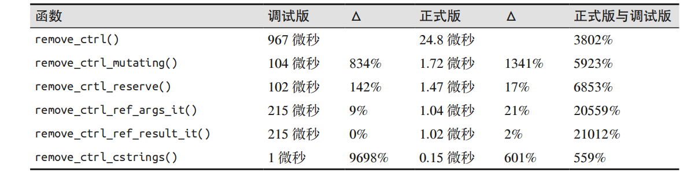

# 本案例分析并且逐步优化字符串构造函数
---
## 六种方式的优化（采用递进形式）
## 从一个由 ASCII 字符组成的字符串中移除控制字符(无优化）
```
string removeCtrl(string s) {
	string result;
	for (int i = 0; i < s.length(); ++i) {
		if (s[i] >= 0x20)
			result = result + s[i];
	}
	return result;
}
```
## 使用复合赋值操作避免临时字符串(优化一）
```
string removeCtrlMutating(string s) {
	string result;
	for (int i = 0; i < s.length(); ++i) {
		if (s[i] >= 0x20)
			result += s[i];
	}
	return result;
}
```
## 通过预留存储空间减少内存的重新分配(优化二）
```
string removeCtrlReserve(string s) {
	string result;
	result.reserve(s.length());
	for (int i = 0; i < s.length(); ++i) {
		if (s[i] >= 0x20) {
			result += s[i];
		}
	}
	return result;
}
```
## 消除对参数字符串的复制(优化三）
```
string removeCtrlRefArgs(const string& s) {
	string result;
	result.reserve(s.length());
	for (int i = 0; i < result.length(); ++i) {
		if (s[i] >= 0x20) {
			result += s[i];
		}
	}
	return result;
}
```
## 使用迭代器消除指针解引（优化四）
```
string removeCtrlRefArgsIt(const string& s) {
	string result;
	result.reserve(s.length());
	for (auto it = s.begin(), end = s.end(); it != end; ++it) {
		if (*it >= 0x20) {
			result += *it;
		}
	}
	return result;
}
```
## 消除对返回的字符串的复制（优化五）
```
void removeCtrlRefResultIt(string& result, const string& s) {
	result.clear();
	result.reserve(s.length());
	for (auto it = s.begin(), end = s.end(); it != end; ++it) {
		if (*it >= 0x20) {
			result += *it;
		}
	}
}
```
## 用字符数组代替字符串（优化六）
```
void removeCtrlRefResultIt(char* destp, const char* srcp, size_t size) {
	for (size_t i = 0; i < size; ++i) {
		if (srcp[i] >= 0x20) {
			*destp++ = srcp[i];
		}
		*destp = 0;
	}
}
```
## 性能总结


